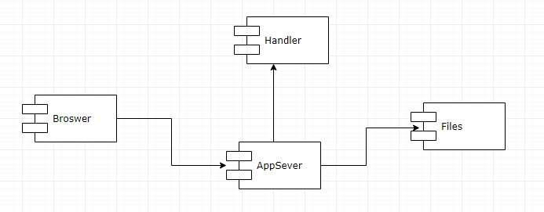
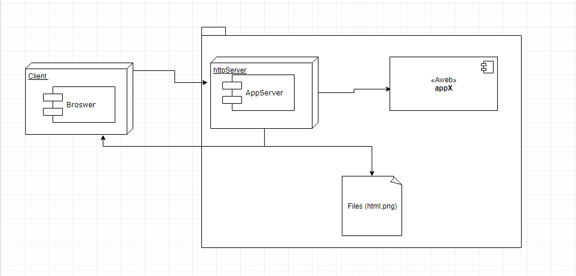

# PROYECTO PRIMER CORTE 
# 2019-2  Arquitectura empresarial Grupo: 1

# Profesor
## Luis Daniel Benavides Navarro, Ph.D. 

# Integrante
## Juan Pablo Ospina Henao

# Heroku app
[Proyecto Juan Ospina](https://salty-river-29279.herokuapp.com/)

# Descripción del laboratorio
### Descripción 

tiene como objetivo la construcción de un servidor Web (tipo apache) en Java.
El servidor debe tener ciertos requisitos como ser capaz de entender páginas HTML e imágenes. 
Además de eso el servidor debe proveer un framework IoC para la construcción de aplicaciones a 
partir de POJOS. Para este caso se tendrá una aplicación básica de calculadora la cual podremos 
realizar actividades de suma, resta, multiplicación, división y potencia

# Diseño
## Arquitectura
### modelo de software

### modelo de despliegue

## Compile and run instructions

* Para ejecutar empaquetar:
mvn package

* si se desa ver realizar la documentacion del codigo
mvn javadoc:javadoc

